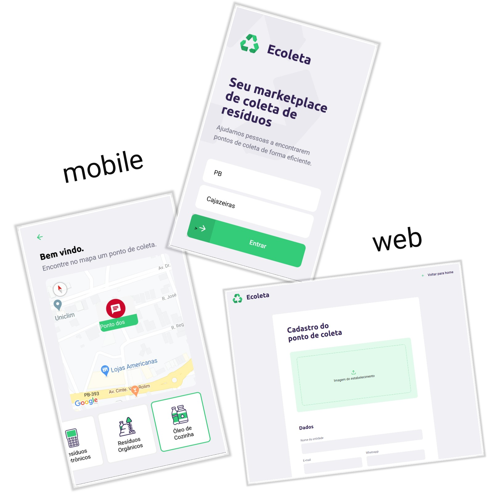

# Ecoleta

Aplicação com o intúito de realizar o cadastramento de pontos de coleta de resíduos orgânicos e inorgânicos, para que pessoas possam descartar seus resíduos de forma ecológica.



### Tecnologias utilizadas

O *back-end* foi desenvolvido com **Node Js + Express**, o *front-end* com **React Js** e o *mobile* com **React Native**. Em todo esse ambiente foram utilizados:

- NodeJS
- React
- React Native
- TypeScript
- Express
- Expo
- Knex
- Multer
- Leaflet
- Multer 

### Iniciando o sistema em ambiente de desenvolvimento

1. Clone o repositório
```https://github.com/devAlbuquerque/NLW_Ecoleta.git```

2. Na raiz do projeto se encontram 3 pastas relacionadas a cada ambiente de desenvolvimento, dentro de cada uma delas execute o seguinte comando:
```npm i```

3. Para iniciar o servidor de aplicação, se dirija a pasta *server* e execute os seguintes comandos (apenas na primeira vez):
```
npm run knex:migrate
npm run knex:seed 
npm run dev 
```
*Obs: os comandos Knex servirão para criar o banco de dados e o popular de início, o dev para iniciar o servidor.*

4. Para iniciar o módulo web, se dirija a pasta *web* e execute o seguinte comando:
``` npm start ```

5. Para iniciar o módulo mobile, se dirija a pasta *mobile* e execute o seguinte comando:
``` npm start ```
